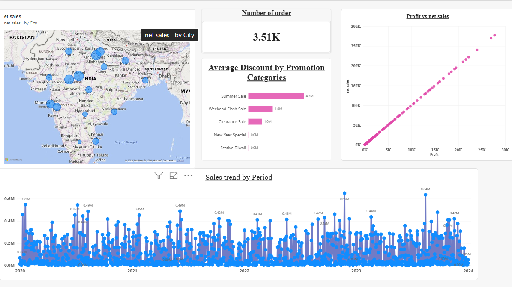
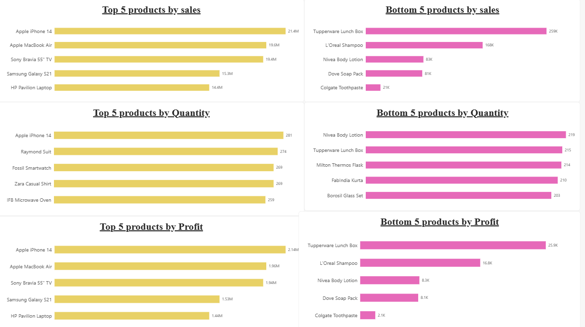
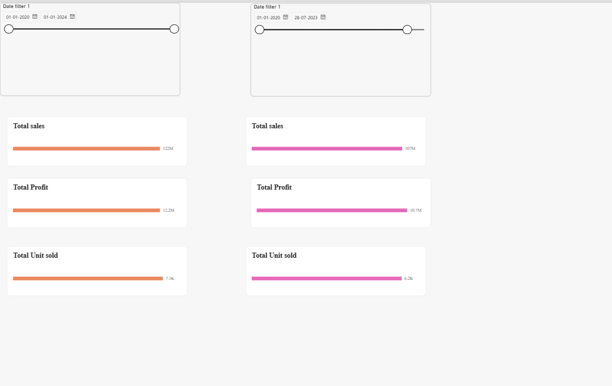
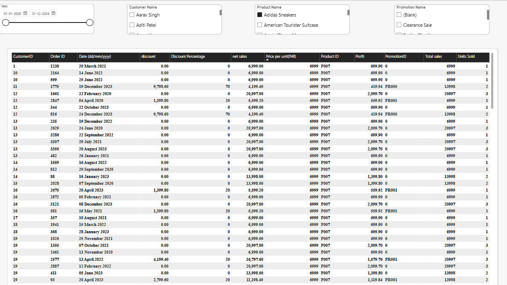
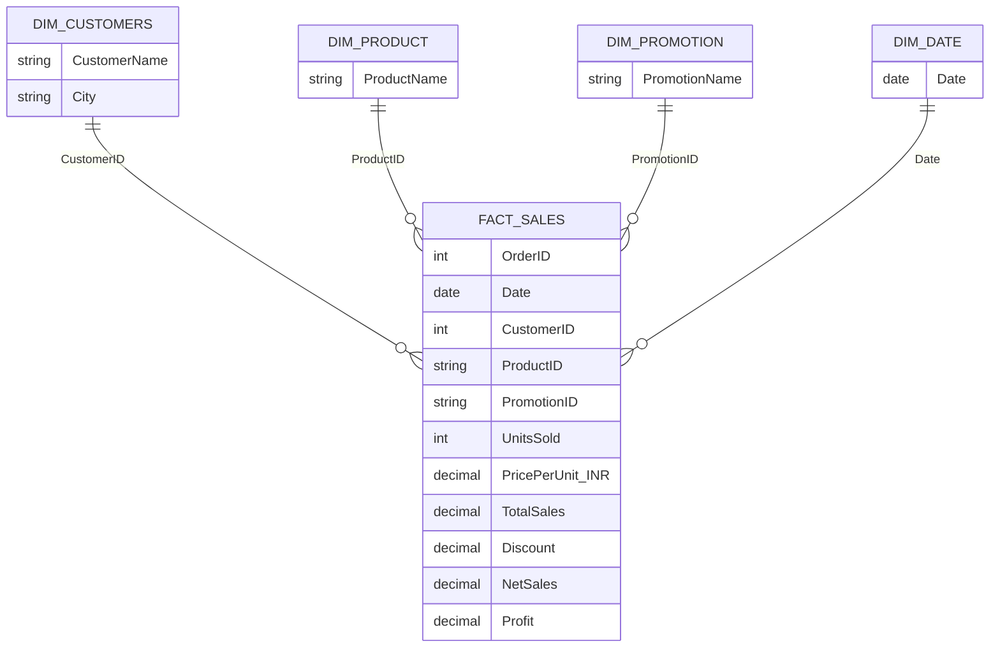

# electrohub-powerbi-dashboard
<h1 align="center">🛒 ElectroHub Sales Analytics Dashboard</h1>

<p align="center">
  <b>An interactive Power BI report analysing 4 years of retail sales, profit, discounts and product performance</b>
</p>

<p align="center">
  
  
  
  
  
</p>

---

## 📊 At a Glance

| 💰 Net Sales | 📈 Profit | 📦 Units Sold | 🧾 Orders | 🛍️ Avg. Order Value |
|:---:|:---:|:---:|:---:|:---:|
| **₹122M** | **₹12.2M** | **7.1K** | **3.51K** | **≈ ₹34.8K** |

<p align="center">
  
</p>
<p align="center"><i>Overview: sales by city, order count, promotion discounts, profit vs sales, and the sales trend over time.</i></p>

---

## 🎯 Project Objective

Give management a single place to see **what sells, where it sells, and how promotions affect revenue**, and let them slice the data by date, customer, product and promotion.

**Questions the dashboard answers**

- Which products drive the most net sales, profit and volume, and which drive the least?
- Which cities generate the most sales?
- Which promotions give away the most discount?
- How did one time period perform compared with another?
- What does an individual order look like? (drill down to transaction level)

---

## 🗂️ Dashboard Pages

### 1. Overview
KPI card, bubble map of net sales by city, average discount by promotion, profit vs net sales scatter plot, and a sales trend line from 2020 to 2023.

### 2. Top / Bottom 5 Products
Six ranked bar charts: **top and bottom 5 by sales, quantity and profit**.

<p align="center">
  
</p>

### 3. Period Comparison
Two independent date slicers let you compare **any two periods** side by side on sales, profit and units sold. Built with *Edit Interactions*, so each slicer controls only its own set of cards.

<p align="center">
  
</p>

*Example: Jan 2020 to Jul 2023 (₹107M sales, ₹10.7M profit, 6.2K units) vs the full period (₹122M, ₹12.2M, 7.1K).*

### 4. Transaction Details
A drill-through table of every order with slicers for **date, customer, product and promotion**.

<p align="center">
  
</p>

---

## 💡 Key Insights

1. **Sales are concentrated in a few premium products.** The top 5 (iPhone 14, MacBook Air, Sony Bravia 55" TV, Galaxy S21, HP Pavilion) bring in about **₹90M of the ₹122M**, roughly **74%** of net sales.
2. **Revenue is driven by price, not volume.** Units sold per product are very similar (about 200 to 280 across the top and bottom 5), yet the best product earns over 1,000x more than the weakest (₹21.4M vs ₹21K for Colgate Toothpaste).
3. **Everyday household and personal-care items sit at the bottom** (Colgate, Dove, Nivea, L'Oréal, Tupperware), each under ₹260K in sales.
4. **Summer Sale gives away the most discount** (₹4.3M), ahead of Weekend Flash Sale (₹1.9M) and Clearance Sale (₹1.0M). New Year Special and Festive Diwali discounts are negligible.
5. **Profit is a flat 10% of net sales in this dataset**, even on orders with a 70% discount, so profit rankings mirror sales rankings.
6. **Sales are spread across many Indian cities**, with visible clusters in north-central India and the Mumbai-Pune region.

---

## 🧱 Data Model

Star schema with one fact table and four dimensions:



Two extra date tables power the side-by-side period comparison, and a dedicated **Measure Table** holds the DAX measures (Net Sales, Profit, Units Sold, Discount %).

---

## 🛠️ Skills Demonstrated

| Area | Details |
|---|---|
| **Data modelling** | Star schema, relationships, dimension tables, date tables |
| **DAX** | Measures for net sales, profit, units sold and discount |
| **Visualisation** | Bar, line, scatter, map, KPI cards, tables, slicers |
| **Interactivity** | Edit Interactions, cross-filtering, independent slicers |
| **Analysis** | Top/Bottom N ranking, period-over-period comparison |

---

## ▶️ How to Open

1. Download **`Electrohub.pbix`** from this repository.
2. Open it in [Power BI Desktop](https://powerbi.microsoft.com/desktop/) (free, Windows).

---

## 🚀 Future Improvements

- Add a **product category** dimension (Electronics, Fashion, Home) for category-level analysis
- Convert the daily trend to **monthly / quarterly** views with year-over-year comparison
- Add **profit margin** analysis using real cost data
- Add a forecast for future sales

---

## 📁 Repository Structure

```
├── Electrohub.pbix          # Power BI report
├── README.md
└── screenshots/             # Dashboard page previews
```

---

## 👤 Author

**Yashika Mule** &nbsp;|&nbsp; [LinkedIn](https://www.linkedin.com/in/yashika-mule-91668b248/) &nbsp;|&nbsp; [Email](yashikamule219@gmal.com)

*This was my first Power BI project. Feedback is welcome!*
